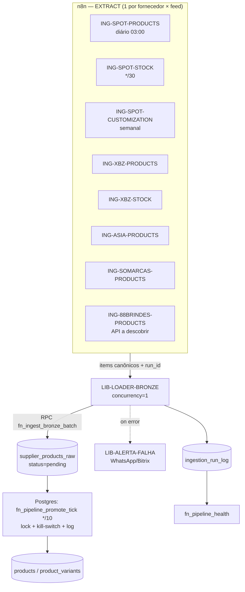

# Plano de Automação de Ingestão (n8n) — Arquitetura Medallion
**Projeto:** promo-gifts-v4 · Supabase `doufsxqlfjyuvxuezpln` (PG 17, sa-east-1)
**Escopo:** ingestão recorrente dos fornecedores → **Bronze** (`supplier_products_raw` / `supplier_customization_raw`), aderente aos princípios da arquitetura Medallion.
**Autor:** sessão de engenharia de dados · **Versão:** 1.0 (proposta para revisão)

---

## 0. Princípio cardinal (a regra que não se quebra)

> **n8n = Extract + Load no Bronze. Só escreve no Bronze, e só via RPC. NUNCA escreve em Silver (`produtos_padronizacao*`) nem em Gold (`products`/`product_variants`).**

A transformação Bronze→Silver→Gold é responsabilidade exclusiva do Postgres (`fn_pipeline_promote_tick`, com lock, kill-switch, log e health — já implementado e testado). Ingestão e transformação são **desacopladas pelo `status` da linha no Bronze**:

```
[n8n EXTRACT+LOAD] → supplier_products_raw (status='pending')
        └────────────── fronteira de contrato (RPC) ──────────────┘
[Postgres TRANSFORM] fn_pipeline_promote_tick (*/10):
        pending → fn_standardize_supplier → produtos_padronizacao (standardized)
                → fn_promote_supplier      → products / product_variants (Gold)
```

Quem viola isso (ex.: os antigos `... - GET Product List` escrevendo direto num MySQL, ou um workflow que faz UPSERT em `products`) cria caminhos paralelos não-rastreáveis — exatamente o problema que acabamos de consolidar.

---

## 1. Os 10 invariantes que o plano obedece

| # | Invariante | Como o plano cumpre |
|---|---|---|
| 1 | **Separação de camadas** | n8n escreve só no Bronze; transform fica no Postgres. |
| 2 | **Idempotência por chave natural** | UPSERT por `(supplier_id, supplier_sku)`. Re-rodar um fetch nunca duplica. **Nunca** `truncate+insert`. |
| 3 | **Contrato via RPC, não tabela** | n8n chama **uma** RPC de ingestão (`fn_ingest_bronze_batch`), não faz INSERT/UPDATE direto. |
| 4 | **`status` é o contrato entre camadas** | Linha entra como `pending`; o tick promove. n8n não mexe em status além do load inicial. |
| 5 | **Bronze é schema-on-read (lossless)** | n8n grava o payload do fornecedor **as-is** em `raw_data` (jsonb). **Zero normalização no n8n** — limpeza/UTF-8/NCM/cor é tudo no Silver. |
| 6 | **Disciplina de rate-limit & payload** | Respeita teto da API (SPOT: 22/dia OptionalsComplete, 96/dia Stocks). Feeds grandes (27 MB/46 MB) em batches; produto 1×/dia, estoque frequente. |
| 7 | **Observabilidade & auditoria** | Toda corrida loga em `ingestion_run_log` e entra no `fn_pipeline_health()`. |
| 8 | **Concorrência segura** | `concurrency=1` por extractor; loader idempotente; o tick tem advisory-lock → ingestão e transform rodam em paralelo sem corrida (status guards). |
| 9 | **Segredos no cofre** | Vault (`SPOT_ACCESS_KEY` + getter `fn_get_spot_access_key()`) / n8n Credentials. Nunca token na URL. |
| 10 | **Modularidade DRY** | 1 sub-workflow `LIB-LOADER-BRONZE` compartilhado + extractors finos por fornecedor/feed. Regra de **versão única** (sem o caos atual de 4 versões do SPOT). |

---

## 2. Topologia de workflows



**Componentes:**

- **`LIB-LOADER-BRONZE`** (sub-workflow compartilhado): recebe `{supplier_code, feed, run_id, items[]}`, faz `SplitInBatches(500)`, chama `fn_ingest_bronze_batch` por lote, acumula contadores, retorna `{fetched, upserted, errors}`. `concurrency=1`.
- **`LIB-ALERTA-FALHA`**: dispara alerta (WhatsApp/Bitrix/e-mail) em falha de corrida.
- **Extractors** (finos, 1 por fornecedor×feed): só fazem auth + fetch (paginado) + mapeamento mínimo p/ shape canônico + chamam o loader. **Não normalizam dados.**

**Convenção de nome:** `ING-<FORNECEDOR>-<FEED>` (extractors) e `LIB-<nome>` (bibliotecas). Tags n8n: `ingestao`, `bronze`, `<fornecedor>`.

---

## 3. A fronteira de contrato — a "API de ingestão" do Bronze

O coração da robustez é **uma única RPC de entrada**, idempotente, que o loader chama. Ela encapsula toda a regra de escrita no Bronze e devolve telemetria. Isso dá ao n8n um contrato estável independente de fornecedor/feed.

### 3.1 RPC proposta (a alinhar com os RPCs já existentes na Fase 0)

```sql
-- PROPOSTA. Na Fase 0 alinhamos com insert_supplier_product_raw /
-- upsert_supplier_stock_raw / upsert_supplier_customization_raw já existentes
-- (este wrapper só padroniza a interface e a telemetria).
create or replace function public.fn_ingest_bronze_batch(
    p_supplier_code text,         -- 'STRICKER'|'XBZ'|'ASIA'|'SOMARCAS'|'88BRINDES'
    p_feed          text,         -- 'products' | 'stock' | 'customization'
    p_run_id        uuid,         -- correlaciona o lote à corrida
    p_items         jsonb         -- array de objetos do fornecedor (as-is)
) returns jsonb                   -- {fetched, inserted, updated, skipped, errors, error_samples}
language plpgsql security definer set search_path=public as $$
/*
  Regras:
  - resolve supplier_id por code (erro se inativo/inexistente)
  - valida p_feed
  - products:   UPSERT em supplier_products_raw
                ON CONFLICT (supplier_id, supplier_sku)
                DO UPDATE SET raw_data=excluded.raw_data,
                              status='pending',          -- re-dispara o pipeline
                              ingest_run_id=p_run_id,
                              updated_at=now()
  - stock:      grava na trilha stock_data (upsert_supplier_stock_raw) — não mexe em raw_data
  - customization: UPSERT em supplier_customization_raw por table_code_option
  - item sem chave natural -> skip + entra em error_samples (não polui o Bronze)
  - transacional por lote; retorna contadores
*/
$$;
revoke all on function public.fn_ingest_bronze_batch(text,text,uuid,jsonb) from public, anon, authenticated;
grant execute on function public.fn_ingest_bronze_batch(text,text,uuid,jsonb) to service_role;
```

> Reaproveitar > recriar: a RPC roteia para os RPCs/funções **já existentes** no projeto — `insert_supplier_product_raw`, `upsert_supplier_stock_raw`, `upsert_supplier_customization_raw`, `fn_import_stock_from_spot` (estoque SPOT→`variant_supplier_sources`), `fn_import_stock_xbz`, `fn_process_asia_stock_pending`. A Fase 0 verifica as assinaturas reais e conecta.

### 3.2 Chave natural (grão = 1 linha por SKU)

| Fornecedor | `supplier_sku` (chave natural) | Observação |
|---|---|---|
| SPOT/STRICKER | `Sku` = `{ProdReference}-{ColorCode}` | já é o padrão no Bronze |
| ASIA | `referencia\|COR` (composto) | multi-cor; **não** usar só `referencia` (causa loop — já documentado) |
| XBZ | a confirmar no feed `GetListaDeProdutos` | provável `referencia` + variação |
| SOMARCAS | a confirmar no `api-lista-preco-revenda` | — |
| 88BRINDES | a definir | API a descobrir |

---

## 4. Catálogo de fontes (endpoints reais) + cadências

| Fornecedor · feed | Endpoint | Auth | Formato | Teto/dia | Cadência | Volume |
|---|---|---|---|---|---|---|
| **SPOT products** | `ws.spotgifts.com.br/api/v1SSL/OptionalsComplete` (após `/AuthenticateClient`) | token (AccessKey→token) | pedir **JSON** | **22** | **1×/dia 03:00** | ~27 MB / 3.612 SKU |
| **SPOT stock** | `.../Stocks` | token | JSON | **96** | **\*/30** | leve / 3.612 |
| **SPOT customization** | `.../customizationTables` | token | JSON | 22 | **semanal dom 04:00** | ~289 |
| **XBZ products** | `api.minhaxbz.com.br:5001/api/clientes/GetListaDeProdutos?cnpj=…` | token (header, **tirar da URL**) | JSON | — | diário 03:20 *(ver §8)* | ~11,6k |
| **XBZ stock** | idem / endpoint de estoque XBZ | token | JSON | — | \*/20 | — |
| **ASIA products** | `asia.ajung.site/api/products` | a confirmar | JSON | — | diário 03:40 | ~1,2k pais |
| **SOMARCAS products** | `www.somarcas.com.br/api-lista-preco-revenda-v1-0-0.php` | a confirmar | JSON/CSV | — | diário 04:00 | ~1,2k |
| **88BRINDES** | **a descobrir** | — | — | — | — | 40 (carga órfã hoje) |

**Stagger obrigatório:** distribuir os horários (03:00/03:20/03:40/04:00…) para não competir entre si nem com o `promote tick` (\*/10). Produto é pesado e raro (1×/dia); estoque é leve e frequente.

**Feed grande (SPOT 27 MB) no n8n:** não carregar em 1 item. Estratégia: baixar via endpoint bulk → `SplitInBatches(500)` → loader. Vigiar memória de execução do n8n; se necessário, paginar por `ProdReference`/letra. Preferir **incremental por `UpdateDate`** quando disponível (economiza cota).

---

## 5. Idempotência & full-refresh (a parte de DBA)

1. **UPSERT por chave natural** (nunca delete+insert). Re-execução = no-op de dados.
2. **`run_id` por execução.** Todo item carregado num pull **completo** de produtos grava `ingest_run_id`.
3. **Soft-delete de descontinuados (sweep):** ao fim de um pull **completo** bem-sucedido, marcar `is_active=false` os SKUs do fornecedor **ausentes** daquele `run_id`:
   ```sql
   -- chamado pelo extractor (via RPC) ao final de um full-pull OK
   create or replace function public.fn_bronze_mark_absent(p_supplier_code text, p_run_id uuid)
   returns integer language plpgsql security definer set search_path=public as $$ ... $$;
   -- UPDATE supplier_products_raw SET is_active=false, status='skipped'
   --  WHERE supplier_id=… AND coalesce(ingest_run_id,'00000000-…') <> p_run_id;
   ```
   Casa com o feed `CanceledProducts` do SPOT e o conceito de `is_active` já existente.
4. **`status='pending'` dispara o pipeline**; o promote é idempotente (validado: 2 ticks = 0 duplicação).
5. **Concorrência:** `concurrency=1` por extractor (evita 2 pulls do mesmo feed); o tick tem advisory-lock próprio. Ingestão (escreve Bronze) e transform (lê Bronze por status) coexistem sem corrida.
6. **Incremental (watermark):** onde a API expõe data de alteração (SPOT `UpdateDate`), guardar `last_watermark` por fornecedor e pedir só o delta — reduz custo e cota.

---

## 6. Robustez: erros, retries, isolamento de falha

- **Por lote:** `try/catch` + `continueOnFail`. Um lote ruim não derruba a corrida inteira.
- **429 / 5xx:** backoff exponencial + jitter; respeitar `Retry-After`. **Circuit-breaker:** se a cota SPOT (`other`) bater no teto, abortar cedo, logar `status='aborted_rate_limit'` e alertar — não ficar martelando.
- **Falha parcial por item:** itens inválidos vão para `error_samples` no log (amostra), não para o Bronze.
- **Dead-letter:** item que falha N vezes → `ingestion_dead_letter` (jsonb + motivo) para reprocesso manual/automático.
- **Validação mínima na borda:** item sem chave natural → `skip` + log (Bronze não recebe lixo).
- **Timeout/paginação:** streaming + batches; nunca um único item de 27 MB.
- **Atomicidade do sweep:** só roda `fn_bronze_mark_absent` se o full-pull terminou **100% OK** (senão, descontinua produto vivo por engano).

---

## 7. Observabilidade & auditoria

**Tabela `ingestion_run_log`** (espelha o `pipeline_run_log` da camada de transform):

| coluna | conteúdo |
|---|---|
| `id`, `run_id` | identidade / correlação |
| `supplier_code`, `feed` | quem/o quê |
| `started_at`, `finished_at`, `duration_s` | tempo |
| `fetched`, `upserted`, `skipped`, `errors` | volumes |
| `status` | `running`/`ok`/`ok_com_erros`/`failed`/`aborted_rate_limit` |
| `error_samples` (jsonb) | amostra de erros |

- Cada extractor **abre** a corrida (`running`) no início e **fecha** no fim (via RPC de log).
- **Integrar no `fn_pipeline_health()`** um bloco `ingestion`: por fornecedor/feed → último `run_id`, idade do último OK, erros 24h. Assim um único `select fn_pipeline_health()` mostra ingestão **e** transform.
- **SLA + alerta:** produto < 26 h desde o último OK; estoque < 1 h. Violou → `LIB-ALERTA-FALHA`.
- **View `vw_ingestion_health`** para dashboard.

---

## 8. Decisão XBZ — não quebrar o que funciona

Hoje o XBZ **não** é alimentado por n8n: roda em **Supabase pg_cron** (`xbz-site-scrape` \*/2, `xbz-stock-sync`, `xbz-enrich`) e está **fresco** (insert de ontem, 100% com estoque). O n8n do XBZ (`XBZ - GET Product List`) aponta pro MySQL legado e está off.

**Recomendação (DBA pragmático):**
- **Migrar o XBZ para n8n por ÚLTIMO**, com **shadow run** (n8n grava numa trilha de comparação) e **diff** contra o que o cron produz, por ≥ 3–5 dias. Só então cutover.
- **Não desligar o `xbz-site-scrape`** até o `ING-XBZ-*` provar paridade (cobertura de SKU, freshness, estoque).
- Começar pelos fornecedores **sem ingestão ativa no Supabase** (SPOT, ASIA, SOMARCAS, 88BRINDES) — ali o ganho é imediato e o risco é zero.

> Alternativa válida: manter o XBZ no Supabase-cron permanentemente e padronizar só os outros 4 no n8n. Decisão de governança sua — o plano suporta os dois (a fronteira `fn_ingest_bronze_batch` é a mesma).

---

## 9. Segredos

- **SPOT:** AccessKey já no **Vault** (`SPOT_ACCESS_KEY`) + getter restrito `fn_get_spot_access_key()`. O extractor SPOT pode ler via getter (chamada `service_role`) ou usar uma **n8n Credential** (Header/token). Padrão recomendado: n8n Credential por fornecedor, Vault como fonte única quando aplicável.
- **XBZ/ASIA/SOMARCAS/88BRINDES:** criar **n8n Credentials** (Header Auth/token). **Tirar o token do XBZ da query string** (hoje exposto na URL).
- Regra: **nunca** segredo em migration, em URL ou hardcoded em node.

---

## 10. Roadmap de implementação (fases + critérios de aceite)

| Fase | Entrega | Critério de aceite |
|---|---|---|
| **0 — Fundação** | `fn_ingest_bronze_batch` + `ingestion_run_log` + `fn_bronze_mark_absent` + integrar `fn_pipeline_health`; `LIB-LOADER-BRONZE` + `LIB-ALERTA-FALHA`. Teste com **payload sintético** (sem tocar fornecedor). | Loader idempotente; log abre/fecha; health mostra bloco ingestion. |
| **1 — Piloto SPOT stock** | `ING-SPOT-STOCK` (96/dia folgado) → loader → `fn_import_stock_from_spot`. | E2E (raw/vss → promote → Gold); 0 dup; freshness < 1 h. |
| **2 — SPOT products** | `ING-SPOT-PRODUCTS` 1×/dia, bulk + batch 500, watermark `UpdateDate`. **Aposentar** as 4 versões SPOT antigas + `GET Product List`→MySQL. | Cobertura ~3.612 SKU; 0 escrita em Silver/Gold pelo n8n; sweep de descontinuados OK. |
| **3 — ASIA + SOMARCAS** | `ING-ASIA-PRODUCTS`, `ING-SOMARCAS-PRODUCTS` (hoje só MySQL/parcial → **criar do zero** no padrão). | Bronze recebe inserts frescos; promove até Gold. |
| **4 — 88BRINDES** | Descobrir API → `ING-88BRINDES-PRODUCTS`. | Sai das 40 linhas órfãs para ingestão real. |
| **5 — XBZ** | Shadow n8n vs Supabase-cron → diff → cutover → desligar cron. | Paridade ≥ 3–5 dias antes do cutover. |
| **6 — Decommission** | Apagar workflows legados (`*-GET Product List`→MySQL, versões SPOT duplicadas); `unschedule` do jobid 1 (já pausado). | Inventário n8n limpo; 1 versão por fornecedor/feed. |

---

## 11. Governança & padrões

- **Versão única** por fornecedor/feed (matar o caos atual de ~10 workflows SPOT).
- **Naming:** `ING-<FORNECEDOR>-<FEED>` / `LIB-<nome>`. **Tags:** `ingestao`,`bronze`,`<fornecedor>`.
- **Versionar no repo:** exportar o JSON dos workflows para `medallion/n8n/` (junto dos `RELATORIO_TESTES_V*.md`).
- **Stagger de cron** documentado; `concurrency=1` em todo extractor.
- **Mudança de schema do Bronze** sempre via migration nomeada (atômica), nunca `CREATE OR REPLACE` solto.

---

## Apêndice A — Esqueleto de um Extractor (`ING-SPOT-PRODUCTS`)

```
Schedule (03:00) 
  → [RPC] abre run em ingestion_run_log (status=running, run_id)
  → HTTP AuthenticateClient → token   (Credential SPOT)
  → HTTP OptionalsComplete (JSON, token)   [paginar/stream se grande]
  → Code: extrai array de SKUs + monta items canônicos (SEM normalizar)
  → SplitInBatches(500)
       → Execute Workflow: LIB-LOADER-BRONZE {supplier_code:'STRICKER', feed:'products', run_id, items}
  → Aggregate contadores
  → [RPC] fn_bronze_mark_absent('STRICKER', run_id)   (só se tudo OK)
  → [RPC] fecha run (status=ok|ok_com_erros, métricas)
  (onError em qualquer ponto) → LIB-ALERTA-FALHA + fecha run status=failed
```

## Apêndice B — Esqueleto do `LIB-LOADER-BRONZE` (compartilhado)

```
Trigger: Executed by Another Workflow {supplier_code, feed, run_id, items}
  → SplitInBatches(500)
       → HTTP/Supabase RPC: fn_ingest_bronze_batch(supplier_code, feed, run_id, batch)
       → acumula {fetched, upserted, errors, error_samples}
  → return contadores
  (continueOnFail por lote; backoff em 429/5xx; dead-letter após N tentativas)
```

---

*Documento de proposta. As assinaturas exatas dos RPCs existentes são confirmadas e conectadas na Fase 0 antes de qualquer ligação ao fornecedor.*
